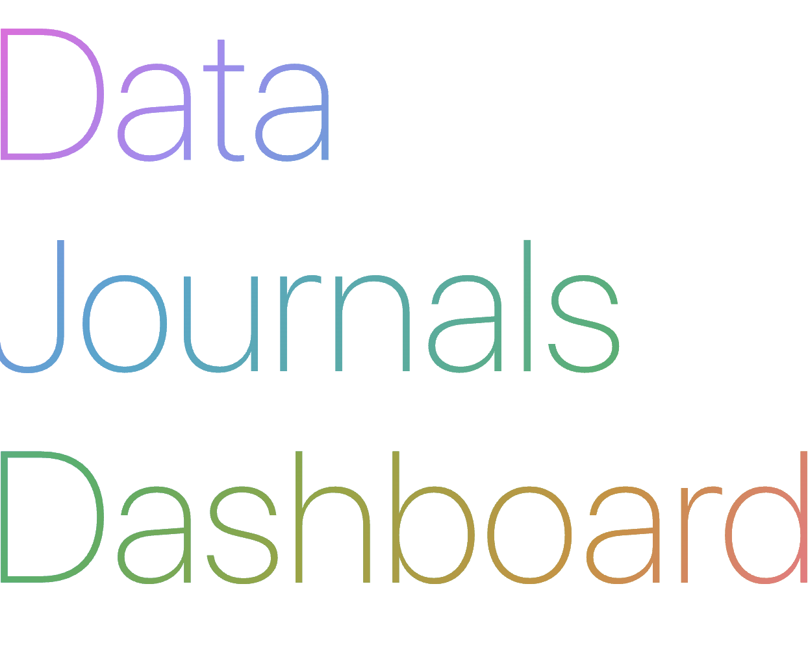

# About



The **Data Journals Dashboard** (DJD) is a browser app for searching and filtering a curated and regularly updated collection of [data journals](https://libguides.wmich.edu/datasci/datajournals), enabling researchers, research data management professionals, librarians, and all other interested parties to find data journals that meet their publication needs.

> The dashboard encourages [community contributions](#contributing)! 🌱

## Table of Contents

- [Journal Metadata](#journal-metadata)
  - [Primary Dataset](#primary-dataset)
  - [Augmented Dataset](#augmented-dataset)
  - [Dataset Licenses](#licenses)
- [Python and Hugo App](#python-and-hugo-app)
  - [App License](#app-license)
- [Contributing](#contributing)
- [Use of AI](#use-of-ai)
- [Citing the Dashboard](#citing-the-dashboard)

## Journal Metadata

### Primary Dataset

The dashboard's primary data source is a list of data journals first published by **Kindling, M. and Strecker, D.** in 2022 and made available under `CC0 1.0 Universal` on [Zenodo](https://doi.org/10.5281/zenodo.7082126) and [GitHub](https://github.com/MaxiKi/data-journals):

- **Zenodo**: Kindling, M., & Strecker, D. (2022). List of data journals (1.0) [Data set]. Zenodo. [https://doi.org/10.5281/zenodo.7082126](https://doi.org/10.5281/zenodo.7082126)
- **GitHub**: [https://github.com/MaxiKi/data-journals](https://github.com/MaxiKi/data-journals)

### Augmented Dataset

The primary dataset is enhanced with additional metadata retrieved via the [Directory of Open Access Journals](https://doaj.org/) (DOAJ) API. Each `ISSN` in the primary dataset is queried against the DOAJ API; if found, additional metadata is retrieved and merged with the existing journal record. 

For `ISSNs` not present in the DOAJ, manual metadata augmentations are made using the journal's website, the [ISSN Portal](https://portal.issn.org/), Wikidata, and other sources. Each journal page in the dashboard lists the specific sources used for its metadata augmentation.

### Metadata Schema

The metadata schema used to integrate all data sources and validate new journal additions is available as well: [Data Journals Dashboard – Metadata Schema](https://github.com/UB-Mannheim/data-journals-dashboard/blob/main/metadata_schema/schema.yaml).

### Licenses

| Source | License |
|---|---|
| Kindling & Strecker (2022) primary dataset | `CC0 1.0 Universal` |
| DOAJ API metadata | `CC0 1.0 Universal` ([Source](https://doaj.org/terms/#metadata)) |
| Manually compiled metadata | `CC0 1.0 Universal` ([CC0 1.0 deed](https://creativecommons.org/publicdomain/zero/1.0/deed.de)) |
| [Data Journals Dashboard – Metadata Schema](https://github.com/UB-Mannheim/data-journals-dashboard/blob/main/metadata_schema/schema.yaml) | `CC0 1.0 Universal` ([CC0 1.0 deed](https://creativecommons.org/publicdomain/zero/1.0/deed.de)) |

## Python and Hugo App

The dashboard is built on two components:

- **Python CLI** (`dj`): A command-line tool for collecting raw journal metadata from GitHub, enriching it via the DOAJ API, validating it against the metadata schema, and exporting it in multiple formats (`CSV`, `YAML`, `JSON`).
- **[Hugo](https://gohugo.io/)**: A static site generator that renders the processed metadata into the browsable dashboard. The dashboard supports filtering by data journal type, publisher, article processing charges (APC), research fields, license types, and more.

Dependencies are managed with [uv](https://docs.astral.sh/uv/). After cloning the repository, install the project with:

```bash
uv sync
```

The CLI entry point is `dj`. Run `dj --help` to see all available commands.

```bash
Usage: dj [OPTIONS] COMMAND [ARGS]...

  Data Journal Dashboard CLI Helper.

Options:
  --help  Show this message and exit.

Commands:
  collect   Fetch or parse raw journal metadata from GitHub or a local...
  process   Process raw journal metadata by validating it against the...
  hugo      Generate Hugo static site content from processed journal data.
  export    Export data journal metadata to different file types.
  validate  Validate journals against metadata schema.
```

### App License

The Python CLI and Hugo application are licensed under the **MIT License**.

## Contributing

The easiest way to contribute to the Data Journals Dashboard is by suggesting a new data journal via a [GitHub issue](https://github.com/UB-Mannheim/data-journals-dashboard/issues/new/choose) using the **"Add Data Journal"** template. The template will ask for the journal's ISSN, title, publisher, URL, type, and status.

After submitting the issue, a maintainer will review your contribution. Once approved, the new journal will be processed and added to the collection.

## Use of AI

Claude Code (`Sonnet 4.6`) was used for coding, bug fixing and testing the Python data processing pipeline as well as the [Hugo](https://gohugo.io/) app. 

Additional journal metadata not provided by the Directory of Open Access Journals' API was for a large part collected with Claude Code and its web search tool, and then manually verified and cleaned.

## Citing the Dashboard

If you use the Data Journals Dashboard in your research or work, please cite it as follows:

Schmidt, T. (2026). *Data Journals Dashboard* (v2026-05-25) [Software]. Universitätsbibliothek Mannheim. https://github.com/UB-Mannheim/data-journals-dashboard
